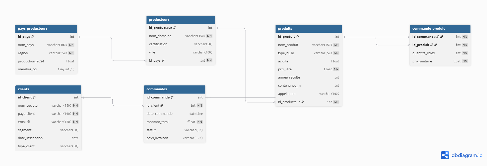

# 🫒 Olive Oil Intelligence — Projet Data Marketing

> **MSc2 Manager Data Marketing — INSEEC 2026**  
> Projet Final Algo & Bases de Données

---

## 📋 Contexte métier

Ce projet simule le système d'analyse data d'un **exportateur international d'huile d'olive**. Les données s'inspirent des statistiques du [Conseil Oléicole International (COI)](https://www.internationaloliveoil.org/).

**Problématique** : Comment segmenter les clients distributeurs internationaux pour optimiser la stratégie commerciale d'un exportateur d'huile d'olive ?

**Réponse** : Pipeline complet SQL → Python → Dashboard avec algorithme RFM pour identifier les clients Gold, Silver et Bronze.

---

## 🗂️ Structure du projet

```
olive-oil-project/
├── sql/
│   ├── init_db.sql        # Création BDD + insertion données (30+ lignes/table)
│   └── queries.sql        # Requêtes SQL (SELECT, JOIN, CTE, VIEW, procédure)
├── python/
│   ├── db.py              # Connexion MySQL sécurisée via .env
│   ├── api.py             # Enrichissement via API REST Countries
│   └── pipeline.py        # Pipeline RFM + écriture MySQL
├── dashboard/
│   └── app.py             # Dashboard Plotly Dash interactif
├── .env.example           # Template variables d'environnement
├── .gitignore             # Fichiers exclus du versioning
├── requirements.txt       # Dépendances Python
└── README.md
```

---

## 🗄️ Modélisation de la base de données

### Schéma (6 tables)



### Tables

| Table | Lignes | Description |
|---|---|---|
| `pays_producteurs` | 30 | Pays membres/non-membres du COI |
| `producteurs` | 30 | Domaines oléicoles par pays |
| `produits` | 30 | Huiles d'olive (Extra Vierge, Vierge, Raffinée, Pomace) |
| `clients` | 30 | Distributeurs internationaux |
| `commandes` | 56 | Commandes 2023-2024 |
| `commande_produit` | 170+ | Table de liaison many-to-many |

### Relations clés
- `producteurs` → `pays_producteurs` (many-to-one)
- `produits` → `producteurs` (many-to-one)
- `commandes` → `clients` (many-to-one)
- `commandes` ↔ `produits` via `commande_produit` **(many-to-many)**

---

## 🔧 Stack technique

| Outil | Usage |
|---|---|
| **MySQL 8.0** | Base de données relationnelle |
| **Python 3** | Pipeline de données |
| **pandas** | Manipulation et analyse des données |
| **mysql-connector-python** | Connexion MySQL depuis Python |
| **requests** | Appels API externe |
| **Plotly Dash** | Dashboard interactif |
| **python-dotenv** | Gestion sécurisée des credentials |
| **dbdiagram.io** | Modélisation DBML |
| **GitHub** | Versioning |

---

## 🧮 Algorithme RFM

L'analyse **RFM (Récence / Fréquence / Montant)** segmente chaque client sur 3 axes :

| Dimension | Calcul | Score 3 | Score 2 | Score 1 |
|---|---|---|---|---|
| **Récence** | Jours depuis dernier achat | < 30j | 30-90j | > 90j |
| **Fréquence** | Nombre de commandes | ≥ 4 | 2-3 | 1 |
| **Montant** | CA total généré | ≥ 10 000€ | 3 000-9 999€ | < 3 000€ |

**Segments finaux :**
- 🥇 **Gold** : score ≥ 8 — clients VIP à fidéliser
- 🥈 **Silver** : score 5-7 — clients à développer
- 🥉 **Bronze** : score < 5 — clients à réactiver

---

## 🌍 API externe

**REST Countries API** (`https://restcountries.com/v3.1`)
- Gratuite, sans clé API
- Enrichit les données avec : devise, capitale, population, région
- Utilisée pour contextualiser les pays clients et producteurs

---

## 📊 Dashboard

Le dashboard Plotly Dash affiche :

- **6 KPIs** : CA total, clients analysés, panier moyen, clients Gold, commandes, clients à risque
- **5 graphiques** : segmentation RFM, CA par pays, types d'huile, scatter RFM, évolution mensuelle
- **3 filtres interactifs** : type de client, pays, segment RFM
- **1 callback** : mise à jour dynamique de tous les éléments

---

## 🚀 Installation et lancement

### Prérequis
- Python 3.10+
- MySQL 8.0
- Git

### Installation

```bash
# 1. Clone le repo
git clone https://github.com/TON_USERNAME/olive-oil-project.git
cd olive-oil-project

# 2. Installe les dépendances
pip install -r requirements.txt

# 3. Configure les variables d'environnement
cp .env.example .env
# Édite .env avec tes credentials MySQL
```

### Base de données

```bash
# Dans MySQL Workbench ou terminal :
mysql -u root -p < sql/init_db.sql
mysql -u root -p olive_oil_db < sql/queries.sql
```

### Pipeline Python

```bash
cd python
python pipeline.py
```

### Dashboard

```bash
cd dashboard
python app.py
# Ouvre http://127.0.0.1:8050
```

---

## 📁 Variables d'environnement

Crée un fichier `.env` à la racine (ne jamais committer) :

```
DB_HOST=localhost
DB_PORT=3306
DB_USER=root
DB_PASSWORD=ton_mot_de_passe
DB_NAME=olive_oil_db
```

---

## 📝 Requêtes SQL notables

Le fichier `queries.sql` contient :

- ✅ 8 requêtes SELECT avec WHERE, GROUP BY, HAVING, ORDER BY, LIMIT
- ✅ Jointure sur 5 tables (clients + commandes + commande_produit + produits + producteurs + pays)
- ✅ CTE (WITH) pour le calcul RFM en 3 étapes
- ✅ Sous-requête pour filtrer sur la moyenne
- ✅ Vue `vue_rfm` réutilisée par Python
- ✅ Procédure stockée `maj_segments_rfm()`

---

## ⚠️ Sécurité

- Les credentials MySQL sont dans `.env` (jamais committé)
- `.env` est listé dans `.gitignore`
- Utilisation de requêtes paramétrées pour éviter les injections SQL

---

*Projet réalisé dans le cadre du MSc2 Manager Data Marketing — INSEEC 2026*
